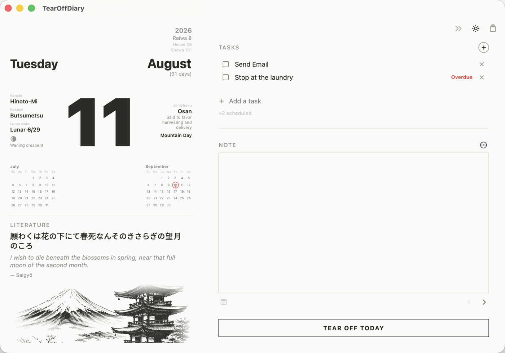
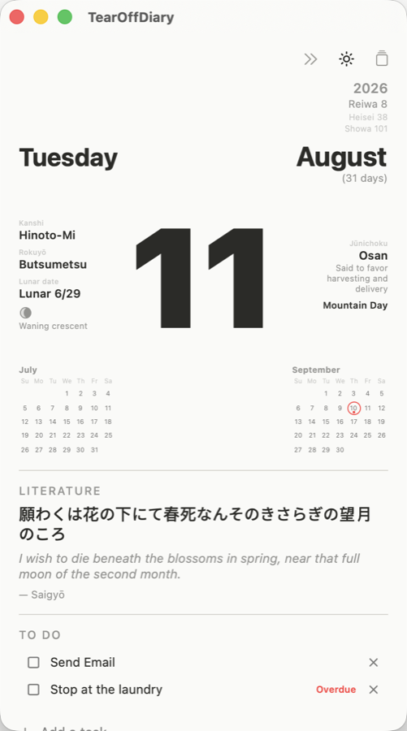
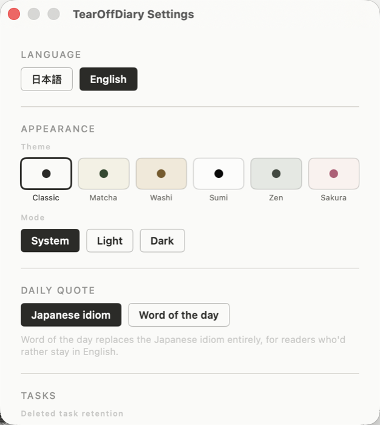

<p align="center">
  
</p>

<h1 align="center">TearOffDiary</h1>
<p align="center"><em>日めくり — a tear-off desk calendar, reimagined as a daily journal.</em></p>

<p align="center">
  
</p>

## Philosophy

A **himekuri** (日めくり) is the paper tear-off calendar that has sat in Japanese homes,
shops, and offices for generations: one page per day, torn off each morning to reveal
the next. It was never a specialist's object — local businesses gave them away as
everyday gifts, and each page carried small, accessible pieces of seasonal awareness
and everyday wisdom (a proverb, a lucky-day note) that anyone could read in passing,
not just people with a particular interest in calendars. The appeal was never the
information alone; it was the small physical ritual of tearing a page away each
morning, deliberate in a way a glance at a phone screen isn't.

TearOffDiary borrows that shape for journaling instead of counting down days, and it's
made for anyone who likes that idea — not a niche technical tool. Each page is a single
sitting: the date, a bit of real calendar/almanac detail connecting the day to the
wider season, a short piece of Japanese literature or idiom, a place to write, a small
task list — and a tear-off action that closes the day and reveals the next one
underneath. Torn pages aren't deleted; they move to the Archive, exactly like a stack
of paper you kept instead of throwing away.

Minimal chrome, typography-led paper surfaces, a dominant date numeral, hairline rules
— the app is meant to feel closer to a physical object on a desk than to software.

## Features

**The daily page**
- One page per day — a Japanese idiom or line of literature (with an English meaning
  underneath), a memo field with light Markdown support, and a persistent task list.
- Real almanac detail, not decorative filler: kanshi (60-day sexagenary cycle), rokuyō,
  kyūreki (old lunar date, with leap-month detection), jūnichoku, moon phase, and a
  triple-era year header (令和/平成/昭和) — all computed from an actual astronomical
  approximation anchored to JST, not a static lookup table.
- Tearing off a page reveals the next day immediately underneath, so you can plan ahead
  — write and tear off several days in one sitting if you want to get ahead of the
  calendar.
- Torn pages are recoverable: restore any entry from the Archive and it becomes the
  current editable page again.
- **Jump to today**: if you've fallen behind, a second icon appears to tear rapidly
  through the backlog and land back on the real calendar date, with a quick tear
  animation for each page passed.

**Tasks**
- A persistent to-do list, separate from any single day — carries forward on its own.
- Checklists, per-task notes, drag-to-reorder, and a "do later" defer date that keeps
  tasks off the main list until they're relevant.
- Deleting a task archives it instead of destroying it — configurable retention (15 /
  30 / 90 days) with a "Recently deleted" restore list in Settings.
- Optional local reminder for tasks with a deadline: a single, simple notification the
  morning something is due. Local-only, no account or server involved.

**Archive**
- Every torn-off page, searchable by journal text or date.
- Read-only aside from Restore, by design.

**Look and feel**
- Six named themes (Classic, Matcha, Washi, Sumi, Zen, Sakura), each with its own paper
  color, accent, and a themed illustration — plus Light/Dark/System modes.
- A real two-pane wide-window layout for larger screens, not just a stretched version of
  the compact page.
- Native macOS fullscreen support.

**Language**
- Full Japanese/English UI toggle — weekdays, era, almanac labels, section headers, all
  of it. The idiom itself always stays in Japanese (English mode adds a translation
  underneath, never replaces it); English mode also offers a separate English
  word-of-the-day for readers who'd rather skip the Japanese entirely.

**Data**
- 100% local and offline — plain JSON files, no account, no backend, no analytics.
- Optional iCloud Drive sync between your own Macs (not a hosted service — just the
  same files shared via your iCloud Drive).
- One-click manual export of your data to a folder of your choosing, any time.
- Automatic crash-safe saving: debounced writes, a save flush on quit, and automatic
  backup-and-recovery if a data file ever turns out to be unreadable.

**Accessibility**
- VoiceOver labels on every icon-only control, real buttons (not tap-only gestures) for
  actions like editing a memo or flipping to the month calendar, Reduce Motion support
  throughout, non-color signals for due-date status, and AA-contrast text across every
  theme. Task reordering is drag-based (mouse/trackpad) only for now.

## Screenshots

<p align="center">
  
  &nbsp;&nbsp;
  
</p>
<p align="center">
  
</p>

## Install

Grab the latest `.dmg` from [Releases](../../releases), open it, and drag TearOffDiary
into Applications.

**About that Gatekeeper warning:** this build is ad-hoc signed, not signed with a paid
Apple Developer ID (that costs $99/year, and this isn't going through the App Store).
macOS will say it "cannot verify" the app or is "from an unidentified developer" the
first time you open it. That's expected, not a sign anything is wrong — right-click the
app → **Open**, confirm once, and it'll launch normally every time after. Alternatively,
after a blocked launch attempt, go to **System Settings → Privacy & Security** and
click **Open Anyway** next to the TearOffDiary warning.

Requires macOS 14 or later. Universal binary — runs natively on both Apple Silicon and
Intel Macs.

## Building from source

No Xcode project — this is a plain Swift Package Manager executable.

```bash
git clone https://github.com/ghostlucius/himekuri.git
cd himekuri
swift build
```

To produce a distributable `.app`/`.dmg` (universal binary, ad-hoc signed):

```bash
./scripts/build_dmg.sh
```

`swift run` is not representative of a real launch (see `scripts/build_dmg.sh` and the
notes there) — use the packaged `.app` for anything beyond a quick compile check.

## Status

Early beta, actively developed. Feedback and issues welcome once this repo opens up
more broadly.
