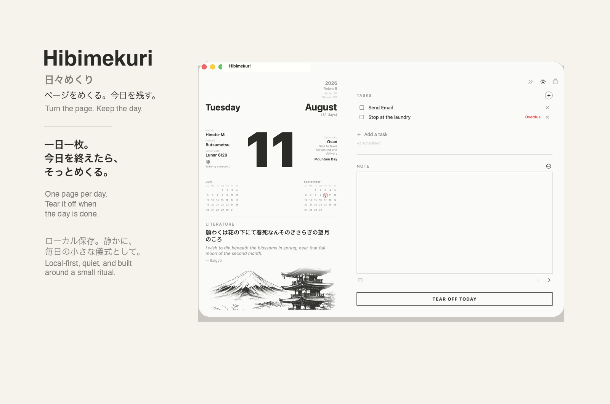
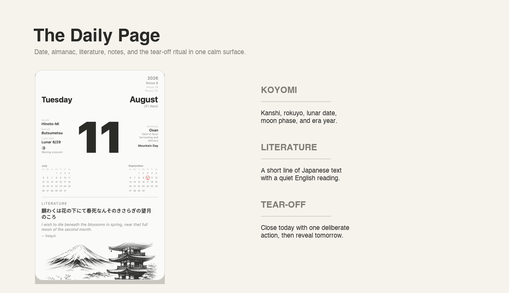
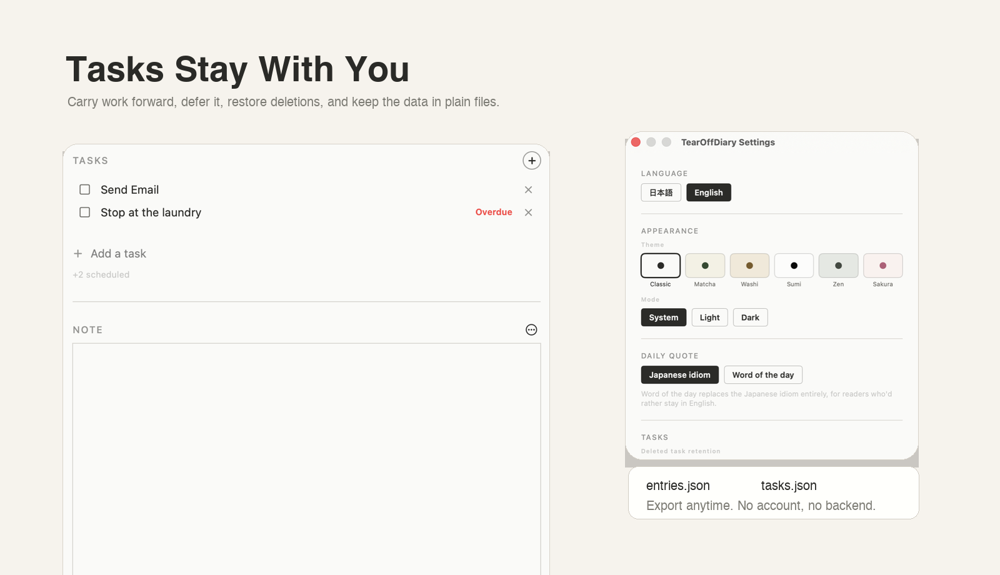
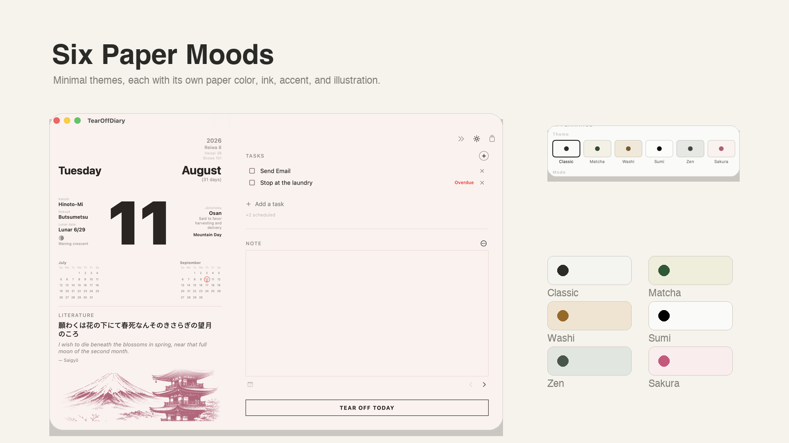

<p align="center">
  
</p>

<h1 align="center">Hibimekuri</h1>
<p align="center"><em>日々めくり — turn the page, keep the day.</em></p>

<p align="center">
  
</p>

## Philosophy

A **himekuri** (日めくり) is the paper tear-off calendar that has sat in Japanese homes,
shops, and offices for generations: one page per day, torn off each morning to reveal
the next. It was never a specialist's object — local businesses gave them away as
everyday gifts, and each page carried small, accessible pieces of seasonal awareness
and everyday wisdom (a proverb, a lucky-day note) that anyone could read in passing,
not just people with a particular interest in calendars. The appeal was never the
information alone; it was the small physical ritual of tearing a page away each
morning, deliberate in a way a glance at a phone screen isn't.

**Hibimekuri** (日々めくり) adds the Japanese repetition mark **々** to that idea:
**日** becomes **日々**, from one day to everyday life. The name suggests turning
through the days one page at a time — a himekuri for the days you keep.

Hibimekuri borrows that shape for journaling instead of counting down days, and it's
made for anyone who likes that idea — not a niche technical tool. Each page is a single
sitting: the date, a bit of real calendar/almanac detail connecting the day to the
wider season, a short piece of Japanese literature or idiom, a place to write, a small
task list — and a tear-off action that closes the day and reveals the next one
underneath. Torn pages aren't deleted; they move to the Archive, exactly like a stack
of paper you kept instead of throwing away.

Minimal chrome, typography-led paper surfaces, a dominant date numeral, hairline rules
— the app is meant to feel closer to a physical object on a desk than to software.

## Features

**The daily page**
- One page per day — a Japanese idiom or line of literature (with an English meaning
  underneath), a memo field for the day's writing, and a persistent task list.
- The memo field supports light Markdown — headers, bulleted/numbered lists,
  blockquotes, code blocks, bold, italic, strikethrough, inline code, and links. You
  write plain text and it renders as soon as you tab away; no separate formatting
  toolbar to fight with.
- Tapping the date numeral flips it to a full month calendar, with any day that has a
  task due marked with a red ring. Tap again to flip back.
- Three quote sources to pick from in Settings: the Japanese idiom, an English word of
  the day, or your own imported quotes — a plain JSON file you provide yourself (see
  [docs/sample-custom-quotes.json](docs/sample-custom-quotes.json) for the format).
- Real almanac detail, not decorative filler: kanshi (60-day sexagenary cycle), rokuyō,
  kyūreki (old lunar date, with leap-month detection), jūnichoku, moon phase, and a
  triple-era year header (令和/平成/昭和) — all computed from an actual astronomical
  approximation anchored to JST, not a static lookup table.
- Tearing off a page reveals the next day immediately underneath, so you can plan ahead
  — write and tear off several days in one sitting if you want to get ahead of the
  calendar.
- Torn pages are recoverable: restore any entry from the Archive and it becomes the
  current editable page again.
- **Jump to today**: if you've fallen behind, a second icon appears to tear rapidly
  through the backlog and land back on the real calendar date, with a quick tear
  animation for each page passed.

**Writing and Focus Mode**
- The wide-window layout's NOTE panel, and every task's notes field, share a richer
  editor than the compact memo: a real WYSIWYG mode (formatting renders live, no
  Markdown syntax visible) with a floating toolbar for headers, bold, italic, links,
  blockquotes, and lists — or a raw Markdown source mode for typing syntax directly, one
  click apart via a toggle icon.
- Real GitHub-style checklists: type `- [ ]` / `- [x]` in Markdown mode and they render
  as ☐/☑ checkboxes, with checked items struck through. See the [User Guide's Markdown
  guide](docs/USER_GUIDE.md#writing-in-markdown) for the full syntax reference.
- **Focus Mode** turns either editor into a full-window, distraction-free writing view
  — one click to enter, Escape or the same icon to exit — for when you want to write
  without the rest of the page around you.

**Tasks**
- A persistent to-do list, separate from any single day — carries forward on its own.
- Single click selects a task; double-click expands it to edit its notes and set a
  "do later" defer date. Drag to reorder within the active or done group.
- A "do later" defer date keeps a task off the main list until that date arrives, and
  doubles as its deadline — see reminders below.
- Deleting a task archives it instead of destroying it right away — configurable
  retention (15 / 30 / 90 days) with a "Recently deleted" restore list in Settings, plus
  a manual "Empty Deleted Tasks…" option if you want it gone immediately.
- Optional local reminder for tasks with a deadline: a single, simple notification the
  morning something is due. Local-only, no account or server involved.

**Archive**
- Every torn-off page, searchable by journal text or date.
- Read-only aside from Restore, by design.

**Look and feel**
- Five named themes (Classic, Matcha, Washi, Zen, Sakura), each with its own paper
  color, accent, and a themed illustration — plus Light/Dark/System modes.
- A real two-pane wide-window layout for larger screens, not just a stretched version of
  the compact page.
- Native macOS fullscreen support.
- The Dock icon shows today's actual date and redraws itself at midnight, matching
  whichever theme and light/dark mode is active.
- A short first-launch introduction to what a himekuri is — reachable again anytime from
  the About panel's "What is a himekuri?" button.

**Language**
- Full Japanese/English UI toggle — weekdays, era, almanac labels, section headers, all
  of it. The idiom itself always stays in Japanese (English mode adds a translation
  underneath, never replaces it); English mode also offers a separate English
  word-of-the-day for readers who'd rather skip the Japanese entirely.

**Data**
- Your data is yours, not the app's. Everything is stored as plain, human-readable
  JSON on your own disk — not a proprietary format or a database locked inside the
  app — so you can open `entries.json`/`tasks.json` in any text editor whenever you
  want, with or without Hibimekuri.
- 100% local and offline — no account, no backend, no analytics. Nothing you write
  ever leaves your Mac unless you turn on iCloud Drive sync yourself.
- Optional iCloud Drive sync between your own Macs (not a hosted service — just the
  same files shared via your iCloud Drive).
- One-click manual export to a folder of your choosing, any time — an immediate copy of
  your entries and tasks, not a request you wait on.
- Automatic crash-safe saving: debounced writes, a save flush on quit, and automatic
  backup-and-recovery if a data file ever turns out to be unreadable.

**Accessibility**
- VoiceOver labels on every icon-only control, real buttons (not tap-only gestures) for
  actions like editing a memo or flipping to the month calendar, Reduce Motion support
  throughout, non-color signals for due-date status, and AA-contrast text across every
  theme. Task reordering is drag-based (mouse/trackpad) only for now.

## Screenshots

<p align="center">
  
</p>
<p align="center">
  
</p>
<p align="center">
  
</p>

## Install

Grab the latest `.dmg` from [Releases](../../releases), open it, and drag the app into
Applications.

**About that Gatekeeper warning:** this build is ad-hoc signed, not signed with a paid
Apple Developer ID (that costs $99/year, and this isn't going through the App Store).
macOS will say it "cannot verify" the app or is "from an unidentified developer" the
first time you open it. That's expected, not a sign anything is wrong — right-click the
app → **Open**, confirm once, and it'll launch normally every time after. Alternatively,
after a blocked launch attempt, go to **System Settings → Privacy & Security** and
click **Open Anyway** next to the app warning.

Requires macOS 14 or later. Universal binary — runs natively on both Apple Silicon
and Intel Macs.

## Building from source

No Xcode project — this is a plain Swift Package Manager executable.

```bash
git clone https://github.com/ghostlucius/hibimekuri.git
cd hibimekuri
swift build
```

To produce a distributable `.app`/`.dmg` (universal binary, ad-hoc signed):

```bash
./scripts/build_dmg.sh
```

`swift run` is not representative of a real launch (see `scripts/build_dmg.sh` and the
notes there) — use the packaged `.app` for anything beyond a quick compile check.

## Documentation

See the [User Guide](docs/USER_GUIDE.md) for a walkthrough of every feature — the
daily page, the almanac fields, tasks, Focus Mode, Markdown formatting, Custom Quote,
themes, and how your data is stored. It's also linked from the app itself: Hibimekuri
menu → About Hibimekuri → User Guide.

## Status

Early beta, actively developed. Feedback and issues welcome once this repo opens up
more broadly.
